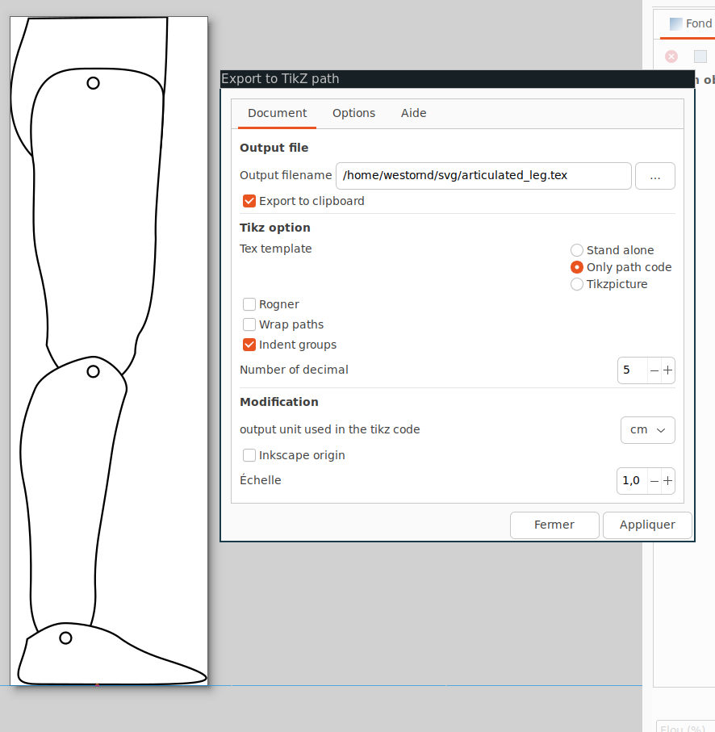
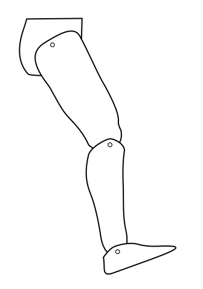

Example
=======

Let's see together how to use SVG2Tikz to convert an SVG to tikz code and include it in your work. Let's take this svg of articulated_leg:

It's composed of several paths:

* A torso
* A Thigh
* A Calf
* A Foot
* 3 articulation joints: Ankle, knee and hip

With the file open in inkscape, we can directly go into Extension/export/Export to tikz path. This open a new window with multiple options in serveral tabs.

First we can check the option `Export to clipboard`. Then in the Tikz option we set to export only the pathcode as we do not need any particular color definition and that we will use this tex file in an another code. We click on apply and we get the following output:

.. literalinclude:: code/articulated_leg_simple.tex
   :language: latex

We can create macro for each articulation:

.. literalinclude:: code/articulated_leg_coordinate.tex
   :language: latex

We separate each path into its own file:

torso.tex:

.. literalinclude:: code/articulated_leg_torso.tex
   :language: latex

thigh.tex:

.. literalinclude:: code/articulated_leg_thigh.tex
   :language: latex

calf.tex:

.. literalinclude:: code/articulated_leg_calf.tex
   :language: latex

foot.tex:

.. literalinclude:: code/articulated_leg_foot.tex
   :language: latex

We can then recombine our svg with the following code:

.. literalinclude:: code/articulated_leg_recombine.tex
   :language: latex

It allows us to control the angle between each member

